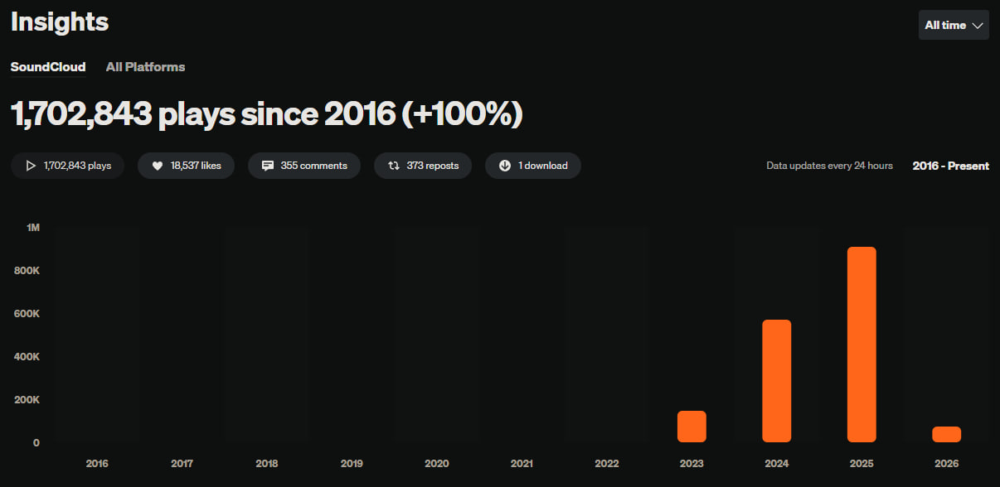

<h1 align="center">👋 Hi, I'm <b>AREKKUZZERA</b></h1>

  

---

## ✨ About Me

- 🎨 I build **modern interactive interfaces**
- ⚛️ Passionate about **React ecosystem & motion-driven UI**
- 🧩 Focused on **design systems & clean architecture**
- 🚀 Always improving UX, performance & visual depth
- 🎵 Exploring sound through remixing & creative production

---

## 🛠️ Tech Stack

### 💻 Frontend

  
  
  

React · TypeScript · Vite · MobX · Framer Motion

---

### 🔧 Backend & APIs

  
  

Node.js · Java (Paper) · REST APIs

---

### 🎯 Design · Motion · 3D

  
  
  
  
  
  
  

**UI/UX & Design**  
Figma · Adobe XD

**Photo & Graphics**  
Photoshop · Illustrator · Lightroom

**Video & Motion**  
Premiere Pro · After Effects · Media Encoder

**3D & Sculpting**  
Blender · ZBrush · 3D-Coat

---

## 🎛️ Producer Card

<table>
<tr>
<td width="52%" valign="top">

<h3>🎵 Music</h3>

I mainly <b>remix & bootleg</b> other artists' work, 
but I occasionally write my own music for fun.

<b>DAW:</b>
FL Studio

<b>Focus:</b> remixing · bootlegs · energetic edits · original ideas

</td>

<td width="48%" valign="top">

<h3>📊 Insights</h3>

<b>1.7M+</b> plays across all tracks

  

  

  Live dashboard with total plays, growth chart, top tracks and overview.

</td>
</tr>
</table>

---

## 🌐 Connect with Me

  
  
  

